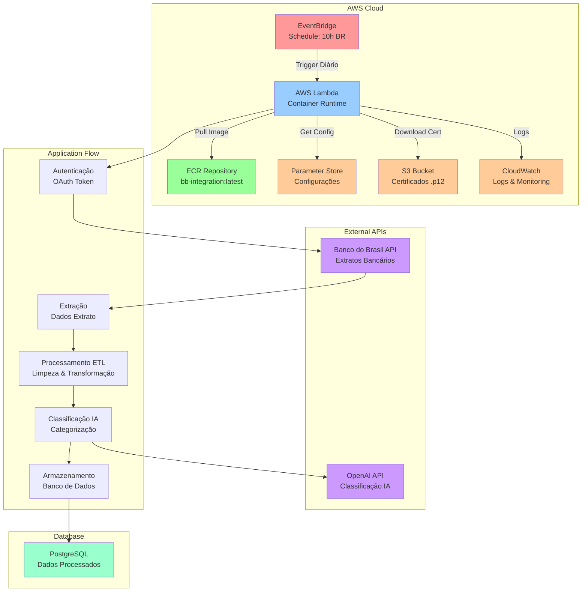

# BB Integration - Sistema de Integração com Banco do Brasil

Sistema automatizado para extração, processamento e classificação de extratos bancários da API do Banco do Brasil, com integração a banco de dados PostgreSQL e classificação inteligente de transações usando IA.

## 🚀 Funcionalidades

- **Extração Automática**: Coleta de extratos bancários via API do Banco do Brasil
- **Processamento ETL**: Transformação e limpeza dos dados extraídos
- **Classificação Inteligente**: Categorização automática de transações usando embeddings e IA
- **Persistência**: Armazenamento em banco de dados PostgreSQL
- **Monitoramento**: Sistema de logs e controle de status de processamento
- **Reprocessamento**: Capacidade de reprocessar datas com falhas

## 📋 Pré-requisitos

- Python 3.8+
- PostgreSQL
- Certificado digital (.p12) do Banco do Brasil
- Conta de desenvolvedor no Banco do Brasil
- Chave da API OpenAI (para classificação de transações)

## 🛠️ Instalação

1. **Clone o repositório**
   ```bash
   git clone <url-do-repositorio>
   cd bb-integration
   ```

2. **Instale as dependências**
   ```bash
   pip install -r requirements.txt
   ```

3. **Configure as variáveis de ambiente**
   ```bash
   cp env.example .env
   ```
   
   Edite o arquivo `.env` com suas credenciais:
   - Configurações do banco de dados
   - Credenciais da API do Banco do Brasil
   - Caminho do certificado digital
   - Chave da API OpenAI

4. **Configure o banco de dados**
   - Crie um banco PostgreSQL
   - Execute os scripts de criação das tabelas (se houver)

5. **Configure o certificado**
   - Coloque seu certificado `.p12` na pasta `certifications/`
   - Atualize o caminho no arquivo `.env`

## 🔧 Configuração

### Variáveis de Ambiente

Crie um arquivo `.env` baseado no `env.example` com as seguintes variáveis:

```env
# Banco de Dados
DB_NAME=seu_banco_de_dados
DB_USER=seu_usuario
DB_PASSWORD=sua_senha
DB_HOST=localhost
DB_PORT=5432

# API Banco do Brasil
CLIENT_SECRET=seu_client_secret
CLIENT_ID=seu_client_id
DEVELOPER_APPLICATION_KEY=sua_developer_key
BASIC_AUTH=sua_basic_auth

# AWS S3
AWS_ACCESS_KEY_ID=sua_access_key_aws
AWS_SECRET_ACCESS_KEY=sua_secret_key_aws
AWS_REGION=us-east-1
S3_BUCKET=credentials-personalized-integrations
S3_CERTIFICATE_KEY=bb-integration/EDIVALDO BEZERRA ALVES.p12

# Certificado
PFX_PASSWORD=senha_do_certificado

# URLs e Configurações
TOKEN_URL=https://oauth.bb.com.br/oauth/token
SCOPE=extrato-info
EXTRATO_URL=https://api-extratos.bb.com.br/extratos/v1/conta-corrente/agencia/XXXX/conta/XXXXX
PROCESS_NAME=extrato_bb_script

# OpenAI
OPENAI_API_KEY=sua_chave_openai
```

## 🚀 Uso

### Execução Local

```bash
python main.py
```

O script principal:
1. Identifica datas pendentes de processamento
2. Obtém token de autenticação
3. Extrai dados do extrato para cada data
4. Processa e classifica as transações
5. Insere no banco de dados
6. Registra o status do processamento

### Deploy AWS Lambda (Produção)

O sistema está configurado para deploy automático na AWS Lambda usando ECR e Serverless Framework:

#### 1. Configurar Parâmetros AWS
```bash
# Configurar parâmetros no AWS Parameter Store
./setup_parameters.sh
```

#### 2. Deploy Completo
```bash
# Deploy da aplicação para AWS Lambda
./deploy-container.sh
```

**Detalhes do Deploy:**
- **Plataforma:** AWS Lambda com Container (ECR)
- **Execução:** Diariamente às 10:00 BR time (13:00 UTC) via EventBridge
- **Timeout:** 15 minutos
- **Memory:** 2048 MB
- **Repositório ECR:** `244641534401.dkr.ecr.us-east-1.amazonaws.com/bb-integration:latest`

#### 3. Comandos de Gerenciamento
```bash
# Testar função Lambda
serverless invoke -f processExtrato

# Ver logs da Lambda
serverless logs -f processExtrato

# Remover stack completo
serverless remove

# Verificar status do deploy
serverless info
```


### Teste de Classificadores

```bash
python test_classifiers.py
```

Testa e atualiza a classificação de transações no banco de dados.

## 🏗️ Arquitetura do Sistema



## 📁 Estrutura do Projeto

```
bb-integration/
├── main.py                      # Script principal
├── lambda_function.py           # Entry point da AWS Lambda
├── Dockerfile                   # Imagem Docker para Lambda
├── serverless.yml              # Configuração Serverless Framework
├── deploy-container.sh         # Script de deploy (excluído do git)
├── setup_parameters.sh         # Configuração de parâmetros AWS (excluído do git)
├── test_classifiers.py         # Teste de classificadores
├── handlers/
│   ├── auth.py                 # Autenticação com BB
│   ├── database.py             # Operações de banco
│   ├── cert_handler.py         # Manipulação de certificados
│   ├── aws_handler.py          # Handler para AWS S3
│   └── embedding_classifier.py # Classificador com IA
├── services/
│   ├── etl_process.py          # Processamento ETL
│   └── bank_statement_analyser.py # Analisador de extratos
├── utils/
│   └── logger.py               # Sistema de logs
├── data/
│   ├── categories_definition.json
│   └── category_embeddings.json
├── certifications/             # Certificados digitais
├── logs/                       # Arquivos de log
└── env.example                 # Exemplo de configuração
```

## 🔍 Funcionalidades Detalhadas

### Sistema de Logs
- Logs rotativos por módulo
- Níveis de log configuráveis
- Armazenamento em arquivos separados

### Sistema de Certificados S3
- Download automático de certificados .p12 do Amazon S3
- Armazenamento temporário local durante processamento
- Limpeza automática após uso
- Suporte a múltiplas regiões AWS
- Tratamento de erros robusto para operações S3

### Classificação de Transações
- **Embedding Classifier**: Usa embeddings da OpenAI para classificação
- **Bank Statement Analyzer**: Análise com GPT-4 para categorização
- Categorias: Fornecedores, Contas Internas, Impostos, Investimentos, Estornos, Outros

### Controle de Processamento
- Registro de status por data
- Reprocessamento automático de falhas
- Identificação de datas não processadas

## 📊 Banco de Dados

O sistema utiliza PostgreSQL com as seguintes tabelas principais:
- `extrato_juridica`: Dados do extrato
- `process_status`: Status de processamento
- `datalancamento`: Controle de datas processadas

## 🔒 Segurança

- Credenciais armazenadas no AWS Parameter Store (produção) ou variáveis de ambiente (desenvolvimento)
- Certificados digitais para autenticação
- Logs sem informações sensíveis
- Arquivos de configuração com credenciais excluídos do git (`.gitignore`)
- IAM roles para acesso seguro aos recursos AWS
- Container isolado na AWS Lambda

## 🐛 Troubleshooting

### Problemas Comuns

1. **Erro de certificado**
   - Verifique se o certificado existe no S3 no caminho especificado
   - Confirme se as credenciais AWS estão corretas
   - Verifique se o bucket e região estão configurados corretamente

2. **Erro de conexão com banco**
   - Verifique as credenciais no `.env`
   - Confirme se o PostgreSQL está rodando

3. **Erro de autenticação BB**
   - Verifique as credenciais da API
   - Confirme se o escopo está correto

4. **Erro de acesso ao S3**
   - Verifique as permissões da conta AWS
   - Confirme se o bucket está acessível
   - Verifique se as credenciais têm permissão para download

### Logs

Os logs estão disponíveis em:
- `logs/extrato_bb.log` - Script principal
- `logs/database.log` - Operações de banco
- `logs/etl_process.log` - Processamento ETL
- `logs/embedding_classifier.log` - Classificação
- `logs/aws_handler.log` - Operações AWS S3

## 🤝 Contribuição

1. Fork o projeto
2. Crie uma branch para sua feature
3. Commit suas mudanças
4. Push para a branch
5. Abra um Pull Request

## 📄 Licença

Este projeto está sob a licença MIT. Veja o arquivo `LICENSE` para mais detalhes.

## 📞 Suporte

Para dúvidas ou problemas, abra uma issue no repositório ou entre em contato com a equipe de desenvolvimento.